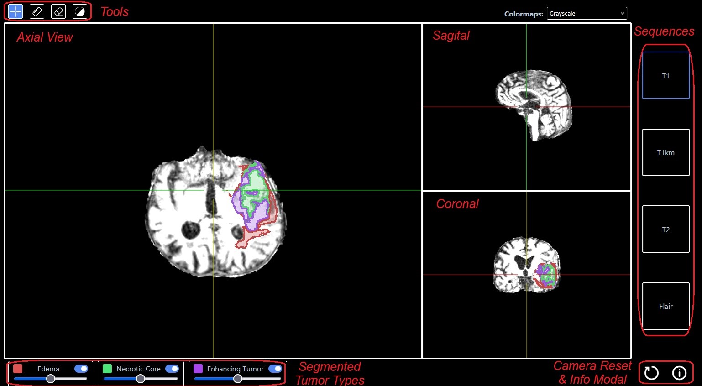
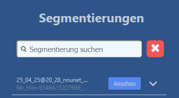
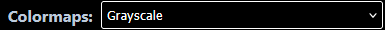
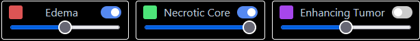

# Benutzeranleitung

In der **Benutzeranleitung** findest du Informationen und Anleitungen zu den Funktionen der App.

## Inhalte

- [Kontoerstellung, Anmeldung und Abmeldung](#KontoErstellenLoginLogout)  
  - [Auf die Whitelist gesetzt werden](#Whitelist)  
  - [Ein Konto erstellen](#KontoErstellen)  
  - [Anmeldung](#Login)  
  - [Abmeldung](#Logout)

- [Wie man ein Projekt erstellt und eine Segmentierung startet](#ProjektSegmentierung)  
  - [Ein Projekt erstellen](#ProjektErstellen)  
  - [Eine Segmentierung starten](#SegmentierungStarten)

- [Wie man den Viewer benutzt](#Viewer)  
  - [Wie man ein Bild in den Viewer lädt](#ViewerLaden)  
  - [Werkzeuge](#ViewerTools)  
  - [Anpassung der segmentierten Tumortypen](#ViewerSegmente)

- [Benutzereinstellungen und -präferenzen](#Einstellungen)

- [Whitelisting](#Whitelisting)

---

## Abschnittserläuterungen

### Kontoerstellung, Anmeldung und Abmeldung
In diesem Abschnitt wird die Kontoverwaltung aus Sicht der Benutzer beschrieben.

### Wie man ein Projekt erstellt und eine Segmentierung startet
In diesem Abschnitt werden die Begriffe *Projekt* und *Segmentierung* erklärt sowie der grundlegende Arbeitsablauf beschrieben.

### Wie man den Viewer benutzt
Dieser Abschnitt erklärt den Viewer im Detail: wie man Bilder lädt, navigiert und die bereitgestellten Werkzeuge verwendet.

### Benutzereinstellungen und -präferenzen
Hier wird der Reiter *Einstellungen* kurz vorgestellt, einschließlich aller Optionen, die geändert werden können.

### Whitelisting
Dieser Abschnitt richtet sich an Projektverantwortliche und erklärt, wie man E-Mail-Adressen für die Kontoerstellung auf die Whitelist setzt.

---

# Kontoerstellung, Login und Logout

In diesem Kapitel erfährst du, wie man ein Konto erstellt, sich anmeldet und abmeldet.\
Um ein Konto zu erstellen, muss deine E-Mail-Adresse zunächst auf die Whitelist gesetzt werden. Anschließend kann die Adresse verwendet werden, um ein Konto zu erstellen und sich einzuloggen.\
Jeder Schritt wird im Folgenden näher erläutert.

## Auf die Whitelist gesetzt werden

Nur Mitglieder der Universität zu Lübeck und des UKSH sind für dieses Projekt zugelassen, d. h. E-Mail-Adressen, die mit „@uni-luebeck.de“ oder „@uksh.de“ enden.\
Um dich zu registrieren, sende deine E-Mail-Adresse an den/die Projektverantwortliche/n. Diese/r wird dich für die App **brainns** freischalten.

## Konto erstellen

Sobald du auf der Whitelist stehst, klicke auf die Schaltfläche **„Account anlegen“** und gib deine E-Mail-Adresse sowie dein gewünschtes Passwort ein.\
Dein Konto ist nun aktiv.

## Login

Verwende die bei der Kontoerstellung angegebenen Zugangsdaten, um dich einzuloggen.

## Logout

Um dich von der App abzumelden, klicke oben rechts auf die Schaltfläche **„Logout“**.\
Nach 24 Stunden wirst du automatisch ausgeloggt.

---

# Projekte und Segmentierungen erstellen

Im Folgenden verwenden wir die Begriffe **Projekt** und **Segmentierung**. Eine **Segmentierung** ist eine Sammlung von Flair-, T1-, T1-KM- und T2-Sequenzen, für die eine Vorhersage der korrekten Ausgabelabel (d. h. kein Tumor und Tumor, ggf. mit Unterscheidung verschiedener Gewebetypen) vorgenommen wird. Ein **Projekt** enthält einen Ordner mit DICOM- oder NIfTI-Dateien, die zusammengehörige Sequenzen enthalten. Innerhalb eines Projekts kannst du beliebig viele Segmentierungen starten, die verwendeten Dateien für die Segmentierung müssen jedoch aus den Dateien des Projekts stammen. Eine Segmentierung gehört also immer genau zu einem Projekt, und jedes Projekt kann (muss aber nicht) mindestens eine Segmentierung enthalten.

## Projekt erstellen

Um ein Projekt zu erstellen, musst du eingeloggt sein.  
Folge dann diesen Schritten, um ein Projekt zu erstellen:

1. Klicke im Home-Tab auf **„Projekt hinzufügen“**.  
2. Gib einen Namen für das Projekt ein und klicke auf **„Hochladen“** (beachte, dass Projektnamen eindeutig sein müssen).  
3. Wähle einen Ordner zum Hochladen aus, der NIfTI- oder DICOM-Dateien enthält. Ein Ordner darf nur NIfTI- oder nur DICOM-Dateien enthalten, nicht beides.  
4. Je nach Browser musst du den Upload eventuell bestätigen.  
5. Wähle mindestens eine Flair-, eine T1-, eine T1-KM- und eine T2-Sequenz aus:  
   - Anhand der Metadaten der Dateien versuchen wir, die korrekte Sequenz für jeden DICOM-Ordner bzw. jede NIfTI-Datei vorherzusagen. Das ist nicht immer möglich oder garantiert korrekt, deshalb prüfe bitte die vorgeschlagenen Sequenztypen sorgfältig.  
   - Pro Sequenztyp (Flair, T1, T1-KM, T2) wird die mit der besten Auflösung automatisch ausgewählt.  
   - Sequenztyp und vorausgewählte Sequenzen können manuell geändert werden. Du kannst alle Sequenzen auf einmal auswählen oder abwählen.  
   - Jederzeit kannst du auf **„Beste Auflösungen“** klicken, um zur Auswahl mit den besten Auflösungen pro Sequenz zurückzukehren. Im Unterschied zur automatischen Vorauswahl berücksichtigt diese Option auch alle benutzerdefinierten Sequenztypen (z. B. wenn eine T2-Sequenz manuell auf T1 geändert wurde).  
   - Klicke nach der Auswahl auf **„Fertig“**. Falls nicht alle genannten Sequenzen ausgewählt wurden, erscheint ein Hinweisfenster mit den fehlenden Sequenzen.  
6. Anschließend gelangst du zu einer Übersichtsseite, die die ausgewählten Sequenzen, das ausgewählte KI-Modell, den Projektnamen und den Namen der Segmentierung (der noch leer ist) anzeigt. Beachte, dass der Projektname (für dieses Projekt), der Segmentierungsname und das KI-Modell (für diese Segmentierung) später nicht mehr geändert werden können.

## Segmentierung starten

Um eine Segmentierung zu starten, folge diesen Schritten:

1. Klappe im Home-Tab die Informationen zu dem Projekt aus, dem du eine Segmentierung hinzufügen möchtest, und klicke auf **„Segmentierung hinzufügen“**.  
   *Falls du noch kein Projekt hast, folge zunächst den Schritten unter [Projekt erstellen](#ProjektErstellen).*  
2. Wähle mindestens eine Flair-, eine T1-, eine T1-KM- und eine T2-Sequenz aus:  
   - Die gleichen Sequenzen, die du zuletzt für dieses Projekt verwendet hast, werden automatisch vorausgewählt.  
   - Die benutzerdefinierten Sequenztypen vom letzten Mal werden ebenfalls übernommen.  
   - Die Auswahl der Sequenzen, Sequenztypen etc. kann wie beim Erstellen eines neuen Projekts angepasst werden.  
   - Klicke nach der Auswahl auf **„Fertig“**.  
3. Du gelangst zu einer Übersichtsseite, die die ausgewählten Sequenzen, das ausgewählte KI-Modell, den Projektnamen und den Segmentierungsnamen (noch leer) anzeigt. Der Projektname kann nicht mehr geändert werden, da du einer bereits existierenden Projekt hinzugefügt hast. Beachte, dass der Segmentierungsname und das KI-Modell (für diese Segmentierung) später nicht mehr geändert werden können.  
4. Klicke auf **„Segmentierung starten“**, um die Segmentierung zu beginnen.  
5. Die Segmentierung wird zuerst hochgeladen und dann vorverarbeitet, bevor die Vorhersage durchgeführt wird.  
   - Den Status kannst du rechts im Bereich **„Letzte Segmentierungen“** verfolgen. Der angezeigte Status wird synchron mit dem tatsächlichen Status im Backend gehalten.  
   - Beachte, dass der gesamte Vorgang, inklusive Hochladen, Vorverarbeitung und Vorhersage, mehrere Minuten dauern kann.

---

# Viewer

Der Viewer ist einer der drei Reiter und ermöglicht es Nutzern, Segmentierungen zu visualisieren.

Segmentierungen können aus den Projekten des Nutzers geladen werden und enthalten die segmentierten Tumorbestandteile: **Ödem (Edema)**, **Nekrotischer Kern (Necrotic Core)** und **Enhancing Tumor (Kontrastmittel-aufnehmender Tumor)**. Der Viewer unterstützt das Umschalten zwischen den Sequenzen: **T1**, **T1 mit Kontrast (T1km)**, **T2** und **FLAIR**. Segmentierungen werden in den Ansichten **Axial**, **Sagittal** und **Koronal** dargestellt.

Zusätzlich bietet der Viewer Werkzeuge für **Window Leveling** (Fensterung) und **Kontrastanpassung** sowie ein **Lineal** zum Messen von Entfernungen.

Die Elemente des Viewers sind im Bild unten beschriftet.

## Wie man eine Segmentierung im Viewer lädt

Im Reiter _Segmentierungen_ auf der linken Seite finden Nutzer ihre Segmentierungen aufgelistet, zusammen mit den zugehörigen Projektnamen.\
Um eine Segmentierung zu laden, klicke im Segmentierungs-Tab auf den Button _Ansehen_.

Nach einem kurzen Moment sollte die ausgewählte Segmentierung im Viewer geladen sein.

## Werkzeuge

Der Viewer bietet verschiedene Werkzeuge zur Unterstützung der Nutzer.\
Oben gibt es vier Hauptwerkzeuge, von denen jeweils nur eines aktiv sein kann.

1. **Cursor**: Der Cursor dient zur Navigation innerhalb der Aufnahme. Ein Linksklick setzt das Fadenkreuz an die Position.
2. **Lineal**: Das Lineal wird zum Messen von Entfernungen verwendet. Mit _Klick und Ziehen_ wird eine Linie gezogen. Die Linie zeigt die Distanz in mm an.
3. **Radiergummi**: Der Radiergummi entfernt Linien, die mit dem Lineal gezeichnet wurden. Um ihn zu benutzen, klicke bei ausgewähltem Radiergummi auf eine Linie, diese wird gelöscht.
4. **Window Leveling**: Dieses Werkzeug verändert Helligkeit und Kontrast des Bildes. Die Bedienung erfolgt durch _Klick und Ziehen_:
   - Nach oben ziehen hellt das Bild auf
   - Nach unten ziehen dunkelt das Bild ab
   - Nach links ziehen erhöht den Kontrast
   - Nach rechts ziehen verringert den Kontrast

Es gibt noch weitere _implizite_ Werkzeuge und Funktionen:

- Linksklick nutzt das aktuell ausgewählte Werkzeug
- Rechtsklick zoomt
- Mausrad scrollt durch die Aufnahmen
- Shift + Linksklick verändert das Window Leveling (wie das Hauptwerkzeug)
- Leertaste wechselt zwischen den Ansichten **Axial**, **Sagittal** und **Koronal**

Unten rechts befinden sich zwei weitere Buttons.

- Der linke Button setzt Kamera und Window Leveling auf die Neutralposition zurück und entfernt alle Messungen.
- Der rechte Button öffnet ein Info-Fenster, das alle Werkzeuge kurz beschreibt.

Oben rechts kann die Farbkarte zwischen mehreren voreingestellten Farbpaletten gewechselt werden, um den Stil des Bildes zu verändern.

## Anpassung der segmentierten Tumorsegmente

Die segmentierten Tumorsegmente können über die Regler unten angepasst werden. Für jeden Typ kann der Alphawert / die Transparenz mit dem Schieberegler geändert oder komplett über den Umschaltknopf ausgeschaltet werden.

---

# Einstellungen

Jeder Nutzer hat Einstellungen, um seine Umgebung zu konfigurieren. Um diese zu öffnen, musst du eingeloggt sein und auf das _Zahnrad_-Symbol oben rechts neben dem Logout-Button klicken.

Aktuell gibt es vier Einstellungen:

1. _Löschen einzelner Einträge über Bestätigungs-Popup bestätigen_:  
   - Wenn diese Option aktiviert ist, erscheint bei jedem Löschen eines Eintrags ein Popup, das bestätigt werden muss.

2. _Anzahl der angezeigten letzten Segmentierungen_:  
   - Mit dieser Option kannst du begrenzen, wie viele Segmentierungen im Home-Tab auf der rechten Seite angezeigt werden.

3. _Download als_:  
   - Hier kannst du zwischen den Download-Formaten NIfTI und DICOM wählen.

4. _Automatisches Window Leveling aktivieren_:  
   - Wenn diese Option aktiviert ist, werden die minimalen und maximalen Pixelwerte direkt aus dem Bild berechnet.  
   - Ansonsten werden die Window-Level-Werte aus den DICOM-Tags ausgelesen.

---

# Whitelisting

Dieser Abschnitt richtet sich an den Projektinhaber.

Um die App nutzen und ein Konto erstellen zu können, muss ein Benutzer zuerst auf die Whitelist gesetzt werden. Die Standard-Domains, die auf die Whitelist gesetzt werden können, sind @uni-luebeck.de, @uksh.de und alle Subdomains. Dies kann in der Funktion `validate_user_mail()` in `fallstudie-ss2024/backend/server/auth/validation.py` angepasst werden.

## Whitelist hinzufügen

Um die Kontoerstellung für eine E-Mail-Adresse zu ermöglichen, melde dich zuerst in PHPMyAdmin an. Nachdem die E-Mail-Adresse in die Tabelle `whitelist` eingetragen wurde, kann ein Konto mit dieser E-Mail-Adresse erstellt werden.

### PHPMyAdmin Login

Zum Einloggen benutze die URL https://141.83.20.81/brainns-db (oder [http://localhost:5080/](http://localhost:5080/), wenn es lokal läuft) und gib Benutzername sowie Passwort ein.

Die Zugangsdaten sind in der Datei `fallstudie-ss24/.env` hinterlegt.

### PHPMyAdmin Whitelisting

Nach dem Login navigiere auf der linken Seite in der Hierarchie zu `my_database/whitelist`.  
Klicke oben auf den Button „Insert“. Es erscheint ein Eingabefeld mit der Bezeichnung „value“. Trage dort die E-Mail-Adresse ein und klicke auf „OK“.

Wenn alles korrekt war, erscheint die Meldung „1 row inserted.“.

Die E-Mail-Adresse kann jetzt zur Kontoerstellung verwendet werden.